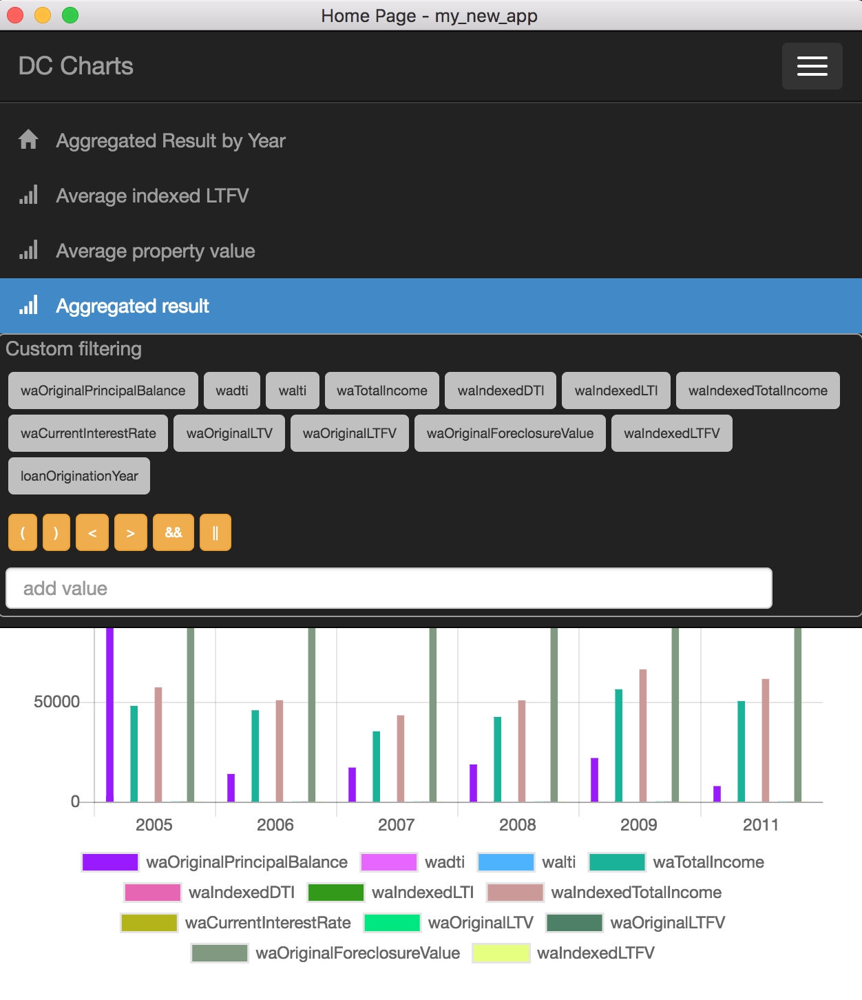

## App features
 * Custom & Complex filtering
 
 * Filter validation & error indication
 
 * Available filters depends on chart's data
 
 * Full responsive design
 

## Pre-requisits
 * .NET Core v2.1
 * node.js > 6.x
 * webpack

## Development server
### .NET Core application which provides API and SPA fallback:
```
cd DC.FrontEndAssignment.WebApi/
dotnet watch run
```
### Angular Live reload by webpack:
```
npm install
npm install -g webpack
cd DC.FrontEndAssignment.WebApi/
webpack -w
```

## Production build
```
cd DC.FrontEndAssignment.WebApi/
dotnet publish
```

This repository already contains a production build in bin/Debug/* directory, so you can run it just by:
```
cd DC.FrontEndAssignment.WebApi/
dotnet run bin/Debug/netcoreapp2.0/publish/DC.FrontEndAssignment.WebApi.dll
```

## Application structure
 * ClientApp/* Angular4 SPA application<br>
 |-app<br>
 &nbsp;&nbsp;&nbsp;|-components/* Angular components<br>
 &nbsp;&nbsp;&nbsp;|- models/* Data models & Helpers<br>
 &nbsp;&nbsp;&nbsp;|- services/* Angular Providers 
 * Controllers/* WebAPI controllers<br>
 |- HomeController.cs - SPA Fallback /index/home<br>
 |- TestScenarioController.cs - REST API /api/* <br>

## ShowCase
